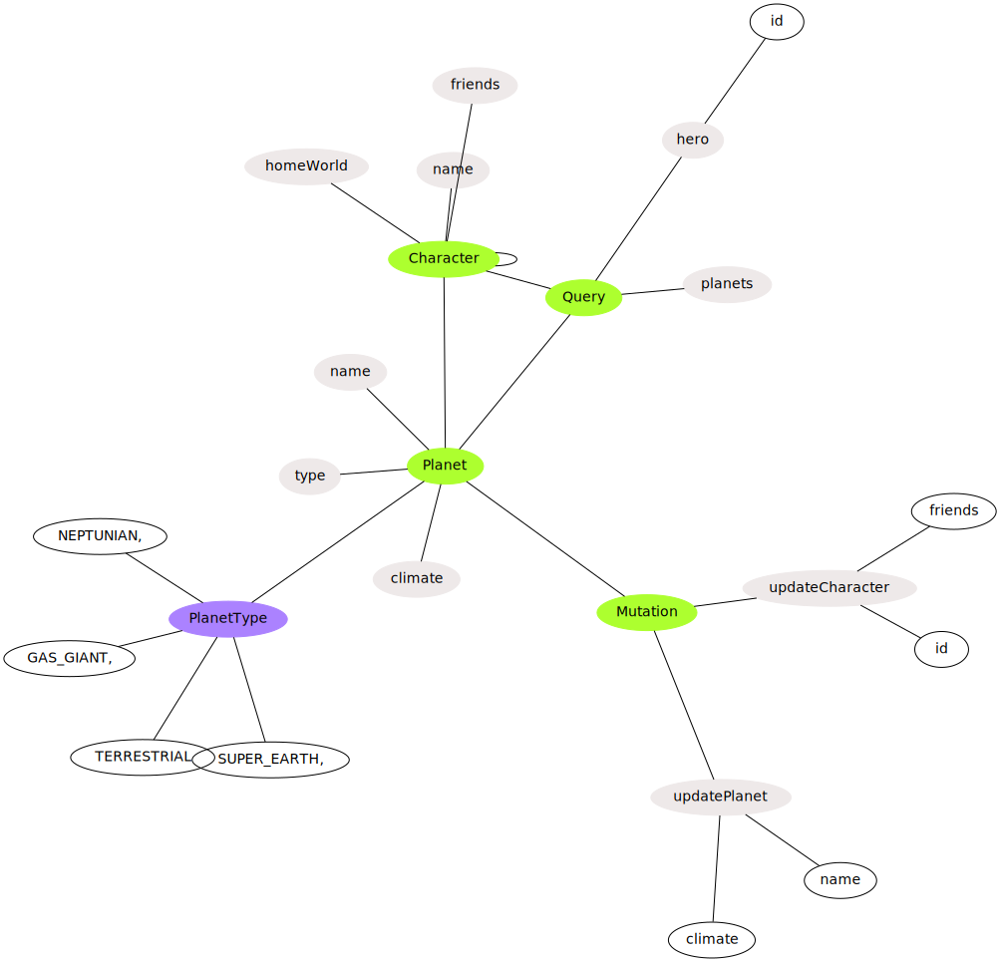
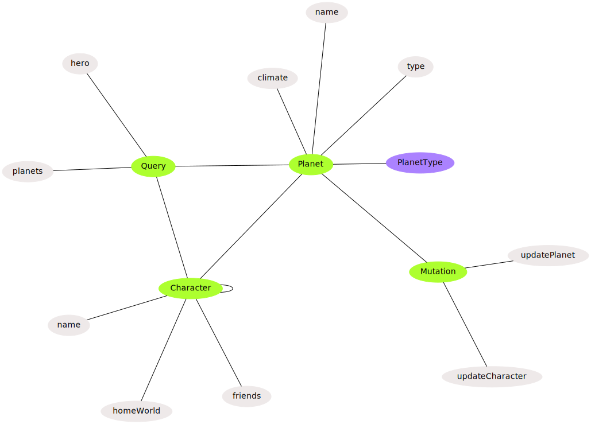

# GQLFedUtils

## Subcommands

### purge

This subcommand will remove any **type** / **input** / **enum** (and their fields) not annotated with some pattern.

GraphQL **schemas** / **directives** / **scalars** are always kept

To use it you need a configuration file with two properties: `keepPatterns`, `secondKeepPatterns`. Example:

```yaml
keepPatterns:
  - "@GK"
  - "@GateKeep"
  - "@GKeep"

secondKeepPatterns:
  - ADMIN
  - ADMINISTRATOR
  - ADMINS
  - admin
  - admins
```

`secondKeepPatterns` is optional, but it may be useful to add more specificity.

With this configuration, a **type** / **input** / **enum** (and their fields) that is not annotated with first and
second patterns will be removed. Example:

```graphql
"""
This should be removed
"""
type SomeType {
    id: ID!
}

"""
This should not be removed
@GateKeep ADMIN
"""
type AnotherType {
    """
    @GK ADMINISTRATOR
    """
    id: ID!

    """
    This will be removed because it's not annotated
    """
    name: String!
}
```

If you run the purge command on the input above, you'll get the following output:

```graphql
"""
This should not be removed
"""
type AnotherType {
  id: ID!
}
```

Notice that all **type** / **input** / **enum** (and their fields) that weren't annotated were removed, and the
annotation was removed from the ones that do were annotated.

That's basically what this subcommand does. Check [`src/test/resources`](src/test/resources) for more examples.
`*.graphql` are input files, `*.expected.graphql` are output files (the expected output for `purge` subcommand)

#### Options

- `-c, --config=<config>`: Path to the config file


- `-s, --suffix=<suffix>`: Output file(s) will contain that suffix. If not given, input file will be overwritten. The
  suffix is added between the file name and _graphql_ extension (if present), e.g. if input file is _file.graphql_ and _
  -purged_ is the suffix, then the output file will be _file-purged.graphql_


- `-e, --exclude=<excludeFiles>`: List of files to exclude from processing. Exclusion files have more precedence than
  input files, i.e. if you provide the same file as input and exclusion, it'll be excluded


- `--overwrite`: If `--suffix` is not given, you'll be asked for confirmation to overwrite input files. Set this flag to
  confirm your decision in advance, so you won't be asked later

Important note: don't annotate Query or Mutation types. This may break the program.

### dot

This subcommand will transpile your GraphQL code into [dot](https://graphviz.org/doc/info/lang.html), so you can get a
visual overview of your graph.

For example, let's say you've the following graph

```graphql
type Query {
  hero(id: ID!): Character
  planets: [Planet]
}

type Mutation {
  updateCharacter(
    id: ID!,
    friends: [Character!],
  ): Characters

  updatePlanet(name: String!, climate: String!): Planet
}

enum PlanetType {
  GAS_GIANT,
  NEPTUNIAN,
  SUPER_EARTH,
  TERRESTRIAL
}

type Character {
  name: String
  friends: [Character]
  homeWorld: Planet
}

type Planet {
  name: String
  climate: String
  type: PlanetType!
}
```

[examples/dot/example.graphql](examples/dot/example.graphql)

If you run

```shell
java -jar gqlfedutils.jar dot example.graphql --output example.dot --params --enum-values
```

The GraphQL schema in [example.graphql](examples/dot/example.graphql) will be converted to dot code in
[example.dot](examples/dot/example.dot).

Then, if you run

```shell
sfdp -Tsvg example.dot > example.svg
```

You'll get a nice visual representation of your graph in [example.svg](examples/dot/example.svg)



As you can see, edges are added between inputs/types/enums because otherwise the graph would really be a mess.

Actually, it already looks a bit messy, that's why `--params` and `--enum-values` options where added

#### Options

- `-o, --output=<outFile>`: Output file in which generated dot code will be saved/


- `--enum-values`: Set this flag to include enum values in the dot output. This may clutter the output graph. Try it,
  see how it looks like, and decide.


- `-p, --params`: Set this flag to include parameters in the dot output. This may clutter the output graph. Try it and
  see how it looks like.

If you run

```shell
java -jar gqlfedutils.jar dot example.graphql --output example.clean.dot
```

You'll get this output



An interesting note:

These tools make extensive use of `String#indexOf` because it is really efficient. It's even more efficient than the
implementation of Rabin-Karp's algorithm
and [here](https://stackoverflow.com/questions/9741188/java-indexof-function-more-efficient-than-rabin-karp-search-efficiency-of-text)
is why

## Dependencies

- [PicoCLI](https://picocli.info/): Parse CLI args and colorize output

- [Jetbrains Annotations](https://www.jetbrains.com/help/idea/annotating-source-code.html): Better code documentation

- [JUnit 5](https://junit.org/junit5/): Test framework

- [Snake YAML](https://bitbucket.org/asomov/snakeyaml/src): parse configuration from YAML file

## License


